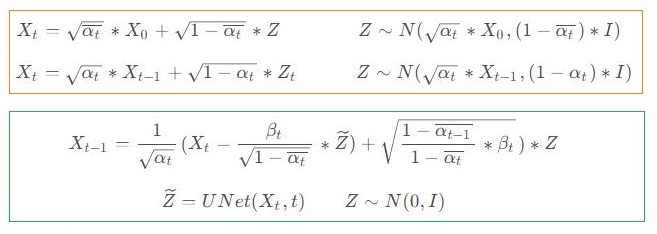

# MultiModal002_DDPM
MultiModal002: DDPM using pytorch

   

## 使用说明
### 要求
> Python >= 3.6 \
> PyTorch >= 1.10  
### 预训练模型
You can download the checkpoints for the models [here](https://drive.google.com/drive/folders/1beUSI-edO98i6J9pDR67BKGCfkzUL5DX?usp=sharing).
### 测试
```shell script
python sample.py  
```
## 参考
https://github.com/dome272/Diffusion-Models-pytorch   
https://blog.csdn.net/samylee  
